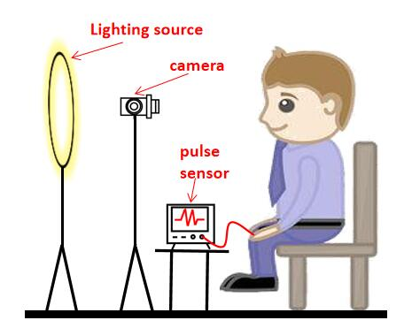
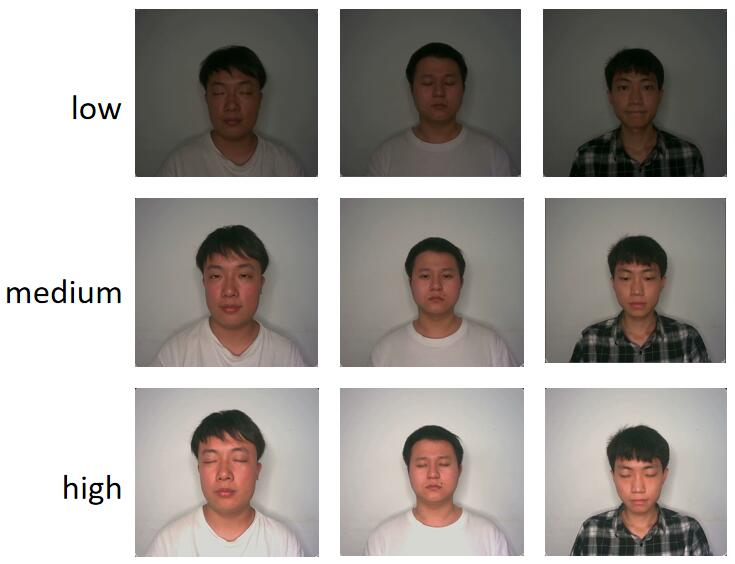

# NLG-rPPG-dataset

## 1.Overview
NLG-rPPG dataset is a dataset consists of 3 lighting conditions which collected in indoor environment. In order to evaluate the performance of deep learning based rPPG under different lighting conditions, we recruited fourteen healthy subjects (10 males and 4 females) on campus, with a  mean age of 23, SD of 1.95. 
## 2.Device setup
There is only a light sources (a fill-in light) that creates different lighting conditions. The ground truth PPG data is obtained by using a finger-type HKG-07C infrared pulse sensor. Video data synchronized with the pulse oximeter was recorded using an Intel RealSense D455C camera. 

## 3.Data details
The videos had a resolution of 640 * 480, and the actual frame rate of the camera was 30 fps. The illuminance levels for the three lighting conditions were 25 Lux, 45 Lux, and 100 Lux, respectively. For each subject, we recorded two one-minute videos under each lighting condition, resulting in a total of six video clips per individual and 84 (14*3*2) video clips in total. The example of different lighting conditions are shown below.

## 4.Contact

## 5.Download
